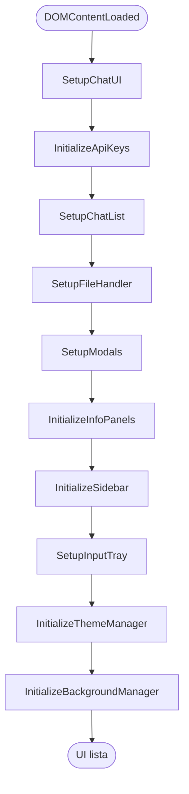

# Arquitectura de Manda Studio

## Puntos clave
- **HTML de entrada**: `index.html` organiza sidebar, área de mensajes, bandeja de entrada y tarjetas de configuración.
- **Scripts modulares**: `scripts/` agrupa funciones independientes importadas por `scripts/index.js`.
- **Persistencia**: `localStorage` guarda chats, tema activo y configuraciones.
- **Estilos escalables**: `styles/` separa layout, componentes y temas. Cada tema redefine variables CSS.
- **Reset global**: `styles/base.css` aplica un reset universal (margin/padding 0, sin bordes redondeados) asegurando que el lienzo use todo el viewport.

## Componentes principales
- `scripts/index.js`: inicializa la UI, modales, gestor de chats, bandeja de entrada, temas y fondos.
- `scripts/chat-manager.js`: CRUD de chats, render de tarjetas, fusión y acciones (copiar, renombrar, eliminar, descargar).
- `scripts/chat-ui.js`: renderiza mensajes (Markdown, código, acciones por mensaje) y coordina la copia al portapapeles.
- `scripts/input-tray.js`: controla envíos, adjuntos y comunicación con el modelo.
- `scripts/theme-manager.js`: aplica temas cargando la hoja correspondiente y sincroniza UI/`localStorage`.
- `scripts/background-manager.js`: añade `div.messages-background`, carga imágenes, mantiene relación de aspecto y responde a `resize`.
- `scripts/file-handler.js` y `scripts/file-downloader.js`: administran adjuntos y exportaciones (Markdown, zip, etc.).

## Flujo de inicialización

## Gestión del historial
- Los chats se guardan como `chat_<id>` en `localStorage`.
- `chat-manager.js` renderiza tarjetas y actualiza `#chat-list` tras cada operación.
- Acciones como fusionar o eliminar muestran notificaciones (`showNotification`). Botones por chat agregan iconos SVG definidos en `chat-manager.js`.

## Personalización de temas
- Las hojas `styles/theme-*.css` redefinen variables (`--background`, `--text`, `--accent`, etc.).
- `theme-manager.js` enlaza botones `.theme-chip` y radios para aplicar el tema activo.
- `styles/variables.css` define la base y se sobrescribe por tema.
- `styles/theme-indigo.css` y `styles/theme-indigo-light.css` añaden overrides para variables legadas (`--bg-main`, `--gradient-chat`, etc.) con el fin de mantener compatibilidad.

## Sistema de fondos
- `background-manager.js` añade `div.messages-background` a `#messages`.
- Carga `components/logo.svg` por defecto, calcula proporciones y ajusta tamaño según el contenedor.
- Los controles de URL y opacidad provienen de Configuraciones → "Fondo del área de mensajes".
- El fondo se posiciona mediante CSS (`.messages-background`) con `transform: translate(-50%, -50%)` y `background-size: contain` para evitar distorsiones.

## Manejo de adjuntos
- `file-handler.js` normaliza archivos y genera previews.
- `input-tray.js` escucha arrastre y botón de adjuntar.
- `utils.js` y helpers adicionales apoyan copiado y formato.
- El archivo empaquetado `MandaStudio-alfa-v53.zip` se genera desde la raíz (`Compress-Archive`) como artefacto de distribución.

## Estilos relevantes
- `styles/layout.css`: layout general, sidebar, bandeja de entrada.
- `styles/messages.css`: burbujas, markdown, botones por mensaje.
- `styles/sidebar-controls.css`: tarjetas de configuración y chips.
- `styles/theme-*.css`: overrides por tema.
- `styles/base.css`: reset y configuración de `body`/`#messages` para ocupar todo el viewport.
- `styles/messages.css`: define las burbujas, acciones con iconos circulares y la superposición del fondo.
